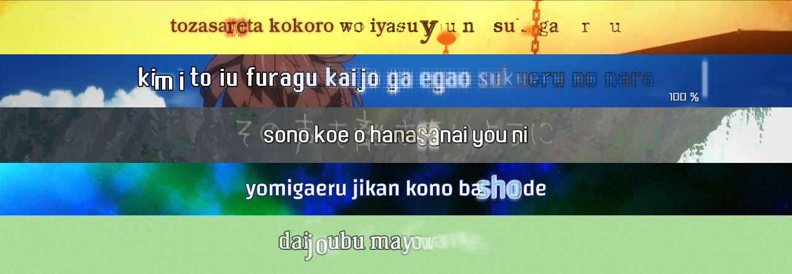

# Welcome to the **PyonFX** library website!

> "PyonFX is an easy way to create KFX (Karaoke Effects) and complex typesetting using the ASS format (Advanced Substation Alpha)."

---

## What *is* PyonFX?

PyonFX is a **Python library** designed to make the creation of **KFX** and **complex typesetting** easy when working with the **ASS (*Advanced Substation Alpha*)** subtitle format. It provides creators with precise, programmatic control over visual effects by allowing detailed manipulation of tags, text, and shapes — extending down to the *frame-by-frame* and *pixel-by-pixel* level.

---

## Key features at a glance

<!-- TODO (McWhite Notes): not sure if anyone new to KFX really cares about them though or understand why they are such a big deal. To make it more general I would probably talk about the features more descriptive, like painting an image in the head of the user what they can do with text manipulation, like "Manipulate and transform shapes with ease to create appealing visual effects". you should really show off and be like "Look what amazing things you can do here!" instead of being so technical. -->

* **High-level dataclasses**: parse .ass file into structured objects (`Meta`, `Style`, `Line`, `Word`, `Syllable`, `Char`), incorporating font metrics and temporal/positional data;
* **Shape manipulation**:
    * **Create**: generate shape objects from geometric primitives (triangle, square, heart, etc.) or custom drawing commands;
    * **Transform**: precisely map, move, align, scale, rotate, and skew shapes;
    * **Advanced editing**: supports Bézier curve flattening and line segmentation for granular shape control;
    * **Buffer**: expand, contract, or extract outlines from shapes;
    * **Morph**: morph smoothly between 2 individual shapes or 2 collections of shapes;
* **Frame-by-frame**: work at the individual frame level, with support for timestamp-based editing (ideal for handling CFR and VFR videos) and built-in utilities to automatically interpolate values between key frames using Penner's easing functions;
* **Pixel-by-pixel**: rasterize text or shapes for direct pixel access, and mask them with images;
* **Colour utilities**: make your KFX lines change seamlessly based on video content, and work with HSV, OKLab, RGB, and ASS color spaces;
* **Live preview**: integrate with MPV for real-time previewing. Changes to scripts are reflected on reload, allowing workflows independent of traditional Aegisub-based previews;
* **Performance tracker**: monitor runtime performance and generated line count;
* **Cross-platform availability**: install it via `pip` on Windows, macOS and Linux;
* **Comprehensive examples and community**: offers over `TBD` example scripts, and is supported by an active community of users.

---

## Explore the documentation

<!-- TODO (McWhite Notes): Explore the documentation looks a bit like a table of contents, which I would expect more at the top tbh. in terms of utility for the user... and I just realize you can't even click them? -->

| Section | Purpose |
|---------|---------|
| **Tutorials** | Step-by-step projects that teach you the basics and beyond. |
| **Guides** | Short “How do I…?” recipes for specific tasks. |
| **Reference** | Auto-generated API for every public class and function. |
| **Explanation** | Deep dives into the library’s architecture and algorithms. |

Happy KFX and typesetting making — and welcome to the community! 🎉
