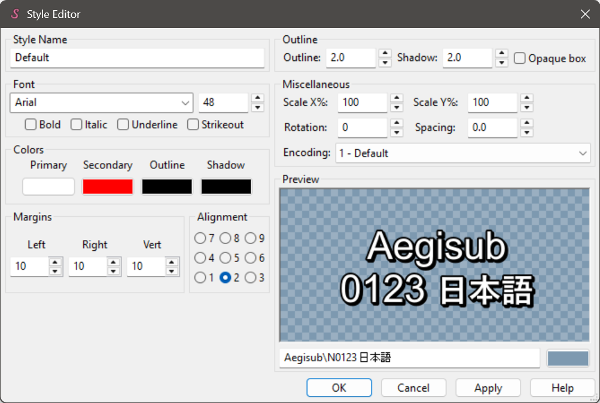
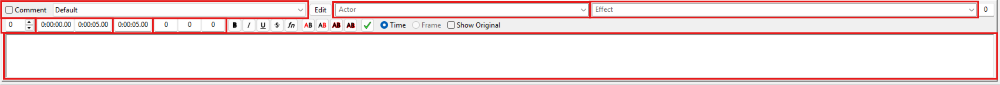

# Tutorial: Exploring ASS Values with PyonFX

Welcome to the first tutorial of PyonFX! In this guide, you'll learn how to use PyonFX to process an ASS file, extract its data, and explore its structure effectively.

We assume you have already read the [Install & Set-up](../installing.md) tutorial.

## Materials
Before starting, please download the following ASS file: [hello_world.ass](https://github.com/CoffeeStraw/PyonFX/blob/v1.0.0/examples/ass/hello_world.ass)

We will use this file throughout the current and future tutorials.

## Code Walkthrough

**0. Importing PyonFX**

Let's start by importing PyonFX. It's a good practice to import only the classes you need, so for this tutorial we'll import only the `Ass` class.

```python
from pyonfx import Ass
```

The `Ass` class is the primary interface for working with ASS files. It handles file loading, parsing, manipulation, and output generation, serving as your main tool for subtitle processing.


**1. Loading and Parsing the ASS File**

Next, we load the ASS file using the `Ass` class. Upon initialization, the class immediately parses the file, and you can access the data using the `get_data` method:

```python
io = Ass("hello_world.ass")
meta, styles, lines = io.get_data()
```

Now you have three important objects to work with:

- `meta`: contains metadata from the ASS file
- `styles`: a dictionary of styles defined in the ASS file
- `lines`: a list of dialogue lines with detailed segmentation

**2. Displaying ASS Data**

Let's take a closer look at these objects.

*Viewing Metadata:*

Print the `meta` object to see the extracted metadata:

```python
print(meta)
```

??? abstract "Show Output"
    ```python
    Meta(wrap_style=0, scaled_border_and_shadow=True, play_res_x=1280, play_res_y=720, audio=None, video='?dummy:23.976000:480:1280:720:59:59:59:', timestamps=<video_timestamps.fps_timestamps.FPSTimestamps object at 0x000001FB6F9864B0>)
    ```

Notably, the metadata includes audio and video file references (`audio` and `video`), display resolution (`play_res_x` and `play_res_y`), and a timestamp object associated with the video file (`timestamps`). For a complete list of attributes and their meanings, refer to the [Meta](../../reference/ass_core.md#pyonfx.ass_core.Meta) documentation.

*Exploring Styles:*

To inspect the styles, iterate over the `styles` dictionary:

```python
for style_name, style in styles.items():
    print(f'"{style_name}": {style}\n')
```

??? abstract "Show Output"
    ```python
    "Romaji": Style(name='Romaji', fontname='Arial', fontsize=40.0, color1='&HFFFFFF&', alpha1='&H00&', color2='&H0000FF&', alpha2='&H00&', color3='&H000000&', alpha3='&H00&', color4='&H000000&', alpha4='&H00&', bold=True, italic=False, underline=False, strikeout=False, scale_x=100.0, scale_y=100.0, spacing=0.0, angle=0.0, border_style=False, outline=2.0, shadow=0.0, alignment=8, margin_l=12, margin_r=15, margin_v=15, encoding=1)

    "Subtitle": Style(name='Subtitle', fontname='Arial', fontsize=40.0, color1='&HFFFFFF&', alpha1='&H00&', color2='&H0000FF&', alpha2='&H00&', color3='&H000000&', alpha3='&H00&', color4='&H000000&', alpha4='&H00&', bold=True, italic=False, underline=False, strikeout=False, scale_x=100.0, scale_y=100.0, spacing=0.0, angle=0.0, border_style=False, outline=2.0, shadow=0.0, alignment=2, margin_l=12, margin_r=15, margin_v=15, encoding=1)
    ```

This should look familiar! The structure closely resembles what you'd find in Aegisub's style editor:

{width="500"}

For more details on each attribute, see the [Style](../../reference/ass_core.md#pyonfx.ass_core.Style) documentation.

*Inspecting Dialogue Lines:*

Now, let's print the first dialogue line to observe its structure:

```python
print(lines[0])
```

??? abstract "Show Output"
    ```python
    Line(comment=False, layer=0, start_time=1000, end_time=3000, style='Romaji', styleref=Style(fontname='Arial', ...), actor='', margin_l=0, margin_r=0, margin_v=0, effect='', raw_text='{\\k50}Hel{\\k50}lo {\\k50}world!', text='Hello world!', i=0, leadin=1001, leadout=1001, width=204.84375, height=40.0, ascent=32.40625, descent=7.59375, internal_leading=4.203125, external_leading=1.171875, x=638.5, y=15, left=536.078125, center=638.5, right=740.921875, top=15, middle=35.0, bottom=55.0, words=[Word(i=0, text='Hello', ...), ... (+1 more)], syls=[Syllable(i=0, text='Hel', ...), ... (+2 more)], chars=[Char(i=0, text='H', ...), ... (+11 more)])
    ```

This should also look familiar — it contains many properties you'd find in Aegisub's Line Editor:


In particular, you can see timing information (`start_time` and `end_time`), the applied style name and its corresponding object (`style` and `styleref`), and both raw text and its version stripped of ASS tags (`raw_text` and `text`). There are many other attributes, but don't worry about them for now.

Most importantly, each `Line` object contains segmented data:

- `Word` objects: segments of the line's text split by spaces
- `Syllable` objects: segments of the line's text defined by karaoke timing tags (`\k`)
- `Char` objects: the individual characters of the line's text

Let's examine these segments by printing the first word, syllable, and character of the first line:

```python
print(lines[0].words[0], "\n")
print(lines[0].syls[0], "\n")
print(lines[0].chars[0], "\n")
```

??? abstract "Show Output"
    ```python
    Word(i=0, start_time=1000, end_time=3000, styleref=Style(fontname='Arial', ...), text='Hello', prespace=0, postspace=1, width=87.515625, height=40.0, x=579.8359375, y=15, left=536.078125, center=579.8359375, right=623.59375, top=15, middle=35.0, bottom=55.0)
    
    Syllable(i=0, word_i=0, start_time=0, end_time=500, styleref=Style(fontname='Arial', ...), text='Hel', tags='\\k50', inline_fx='', prespace=0, postspace=0, width=55.703125, height=40.0, x=563.9296875, y=15, left=536.078125, center=563.9296875, right=591.78125, top=15, middle=35.0, bottom=55.0)
    
    Char(i=0, word_i=0, syl_i=0, syl_char_i=0, start_time=0, end_time=500, styleref=Style(fontname='Arial', ...), text='H', inline_fx='', width=25.84375, height=40.0, x=549.0, y=15, left=536.078125, center=549.0, right=561.921875, top=15, middle=35.0, bottom=55.0)
    ```

Notice how many attributes from the parent `Line` are shared with its words, syllables, and characters.

## Conclusion

Good job. You've successfully explored the structure of an ASS file using PyonFX. In this tutorial, you learned how to load and parse an ASS file, inspect its metadata, review style configurations, and examine the segmentation of dialogue into words, syllables, and characters.

Up next, we'll guide you through writing your first line in a new ASS file.

## Full Source Code
??? abstract "Show full source code"
    ```python
    --8<-- "examples/tutorials/0_first_steps/01_explore_ass_values.py"
    ```
