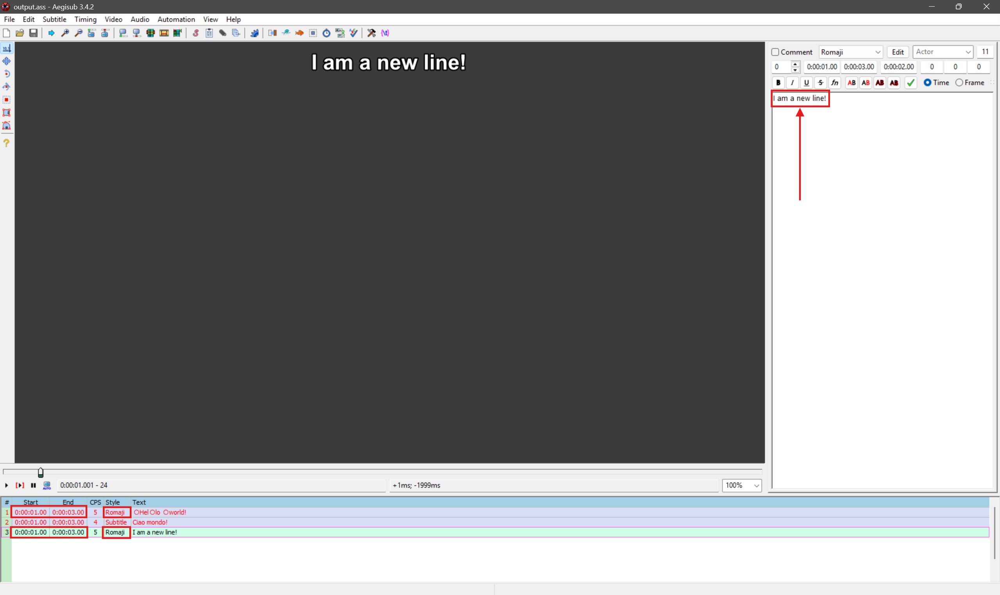

# Tutorial: Hello World with PyonFX

In this tutorial, you'll learn how to create a new subtitle line and produce a new ASS file with your changes.

## Materials

We'll continue working with the [hello_world.ass](https://github.com/CoffeeStraw/PyonFX/blob/v1.0.0/examples/ass/hello_world.ass) file of the previous tutorial.

## Code Walkthrough

**0. Importing PyonFX**

We start by importing the `Ass` class from PyonFX.

```python
from pyonfx import Ass
```

**1. Setting Up Input and Output Files**

The `Ass` class does more than just parse input files—it also manages output generation. When initializing an `Ass` object, you can specify both input and output file paths:

```python
io = Ass("hello_world.ass", path_output="output.ass")
```

This setup creates an output buffer that will become your new ASS file. By default, PyonFX copies all original lines to the output but comments them out, so you can see both the original content and your modifications. You can control this behavior with the `keep_original` parameter—see the [Ass initialization documentation](../../reference/ass_core.md#pyonfx.ass_core.Ass.__init__) for more details.

Now let's extract the data from our input file as we did in the previous tutorial:

```python
meta, styles, lines = io.get_data()
```

**2. Creating a Copy of a Line**

When creating new lines in PyonFX, always start by copying an existing line rather than building one from scratch:

```python
output_line = lines[0].copy()
```

The `copy()` method duplicates everything: timing information, style, actor/effect fields, margins, and more. This approach saves significant effort because manually setting up a new line requires configuring dozens of attributes correctly.

Starting with a copy means you only need to modify the specific properties you want to change—typically `text`, `start_time`, `end_time`, and `layer`.

**3. Modifying the Line**

Now we can safely modify our copied line. Let's change the text to demonstrate the modification:

```python
output_line.text = "I am a new line!"
```

**4. Adding the Line to Output**

After modifying the line, add it to the output buffer using the `write_line()` method:

```python
io.write_line(output_line)
```

This queues your modified line for inclusion in the final output file. You can call `write_line()` multiple times to add as many lines as needed.

**5. Saving the Output File**

Once you've added all your new lines, save the output buffer to disk:

```python
io.save()
```

This writes the complete ASS file to your specified output path (`output.ass` in our example), including any commented original lines and your new modifications. The `save()` method also automatically prints helpful statistics about your processing:

??? abstract "Show Output"
    ```python
    🐰 Produced lines: 1
    ⏱️ Total runtime: 0.0s (avg 0.021s per generated line)
    ```

These metrics help you track your subtitle generation progress and performance. If you prefer to suppress these messages, you can use `io.save(quiet=True)`.

**6. Previewing in Aegisub**

PyonFX provides a convenient method to open your output file directly in Aegisub for review:

```python
io.open_aegisub()  # requires Aegisub to be installed and available in your system PATH
```

When Aegisub opens, you'll see something like this:



Notice how the original lines appear commented out, while your new line appears as an active subtitle with the same timing and styling as the original but with your modified text.

## Conclusion

Good job. You've successfully learned the fundamental workflow for creating modified ASS files with PyonFX. In this tutorial, you discovered how to set up input and output files, copy existing lines as templates, modify line properties, and save your changes. This pattern of copying, modifying, and writing lines forms the foundation for more complex subtitle effects and transformations.

In the next tutorial, we'll dive into line positioning and timing, exploring how to precisely control where and when your subtitles appear on screen using PyonFX's positioning properties and alignment options.

## Full Source Code
??? abstract "Show full source code"
    ```python
    --8<-- "examples/tutorials/0_first_steps/02_hello_world.py"
    ```