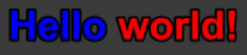

# Tutorial: Text Segmentation with PyonFX

In this tutorial, you'll learn about one of PyonFX's most used features: **automatic text segmentation**. You'll discover how PyonFX breaks down subtitle lines into individual words, syllables, and characters, and how to work with each segment to create precise karaoke effects.

## Materials

We'll continue using the [hello_world.ass](https://github.com/CoffeeStraw/PyonFX/blob/v1.0.0/examples/ass/hello_world.ass) file from previous tutorials.

## Understanding Text Segmentation

When PyonFX processes an ASS line, it automatically segments the text into three hierarchical levels:

- **Words**: Text segments separated by spaces
- **Syllables**: Text segments defined by karaoke timing tags (like `\k`, `\ko`, `\kf`, etc.)
- **Characters**: Individual characters within the text

Let's explore how to access and work with each segment type.

## Code Walkthrough

**0. Setup and Data Loading**

We start with the familiar setup pattern:

```python
from pyonfx import Ass

# Load the input ASS file
io = Ass("hello_world.ass")
meta, styles, lines = io.get_data()

# Use the first line from the file
line = lines[0]
l = line.copy()
```

**1. Exploring Syllable Segmentation**

Let's start by understanding how syllables work, since they're the foundation of most karaoke effects. First, let's examine what syllables look like in detail, similar to what we did in [Exploring ASS values](01-explore-ass-values.md):

```python
# Let's explore the syllables of our line
for syl in line.syls:
    print(f"Syllable {syl.i}: '{syl.text}' - Start: {syl.start_time}ms, End: {syl.end_time}ms")
    print(f"  Position: center=({syl.center:.1f}, {syl.middle:.1f})")
    print()
```

??? abstract "Show Output"
    ```python
    Syllable 0: 'Hel' - Start: 0ms, End: 500ms
        Position: center=(563.9, 35.0)

    Syllable 1: 'lo' - Start: 500ms, End: 1000ms
        Position: center=(607.7, 35.0)

    Syllable 2: 'world!' - Start: 1000ms, End: 1500ms
        Position: center=(687.2, 35.0)
    ```

Run this code and you'll see that each syllable has the same properties we learned about for lines:

- **Text content**: The actual syllable text (like "Hel", "lo", "world!")
- **Timing**: `start_time` and `end_time` relative to the line's start
- **Positioning**: `center`, `middle`, `left`, `right`, `top`, `bottom` properties
- **Index**: `i` property indicating its position in the sequence

This is powerful! Each syllable is essentially a mini-line with its own timing and positioning.

**2. Creating Your First Syllable Effect**

Now that we understand the structure, let's make each syllable appear and disappear based on its timing, positioned exactly where it would naturally appear:

```python
# Process syllables with their natural timing and positioning
for syl in line.syls:
    l.start_time = syl.start_time
    l.end_time = syl.end_time
    l.text = "{\\an5\\pos(%.3f,%.3f)}%s" % (
        syl.center,
        syl.middle,
        syl.text,
    )
    io.write_line(l)
```

This creates a basic effect where each syllable appears individually in its timing window, positioned at its natural location within the line. If you save and open this in Aegisub, you'll see something like:


**3. Adding Colors for Clarity**

Now let's add some color to make the segmentation more visible. We'll define alternating colors and apply them to each syllable:

```python
# Define color codes for red and blue
RED = "&HFF0000&"
BLUE = "&H0000FF&"

# Process syllables with alternating colors
for syl in line.syls:
    color = RED if (syl.i % 2 == 0) else BLUE
    l.start_time = syl.start_time
    l.end_time = syl.end_time
    l.text = "{\\an5\\pos(%.3f,%.3f)\\1c%s}%s" % (
        syl.center,
        syl.middle,
        color,
        syl.text,
    )
    io.write_line(l)
```

The alternating red and blue colors help you clearly see each individual syllable as it appears and disappears.

**4. Extending to All Segment Types**

The same principles apply to words and characters. Let's extend our effect to show all three segmentation levels at different times. We'll add time offsets so you can see each type separately:

```python
# Process words: words start to appear from 0ms
all_words_start = 0
for word in line.words:
    color = RED if (word.i % 2 == 0) else BLUE
    l.start_time = all_words_start + word.start_time
    l.end_time = all_words_start + word.end_time
    l.text = "{\\an5\\pos(%.3f,%.3f)\\1c%s}%s" % (
        word.center,
        word.middle,
        color,
        word.text,
    )
    io.write_line(l)

# Add the syllables from section 3 with a time offset: syllables start to appear from 3000ms
all_syls_start = 3000
for syl in line.syls:
    color = RED if (syl.i % 2 == 0) else BLUE
    l.start_time = all_syls_start + syl.start_time
    l.end_time = all_syls_start + syl.end_time
    l.text = "{\\an5\\pos(%.3f,%.3f)\\1c%s}%s" % (
        syl.center,
        syl.middle,
        color,
        syl.text,
    )
    io.write_line(l)

# Process characters: characters start to appear from 5000ms
all_chars_start = 5000
for char in line.chars:
    color = RED if (char.i % 2 == 0) else BLUE
    l.start_time = all_chars_start + char.start_time
    l.end_time = all_chars_start + char.end_time
    l.text = "{\\an5\\pos(%.3f,%.3f)\\1c%s}%s" % (
        char.center,
        char.middle,
        color,
        char.text,
    )
    io.write_line(l)
```

Here's what we're doing:

- **Words (0-3000ms)**: Show word-level segmentation first
- **Syllables (3000-5000ms)**: Then syllable-level segmentation
- **Characters (5000ms+)**: Finally character-level segmentation

Each segment type uses the same pattern: iterate through the collection, apply alternating colors, position at the segment's natural location, and time it according to the segment's properties plus our time offset.

**5. Saving and Previewing**

As always, we save our work and open it for preview:

```python
io.save()
io.open_aegisub()
```

You should get something like:



Notice that:
- **Words** start and end times coincide with the line's start and end times
- **Characters** start and end times coincide with the syllables' start and end times

This timing relationship reveals the intended use of each segment type:

- **Syllables** are perfect for traditional karaoke effects, where each syllable highlights according to the song's timing (defined by `\k` tags)
- **Characters** inherit syllable timing, so you can do everything you would do with syllables, but with more granularity
- **Words** span the entire line duration, making them useful for word-by-word reveals, word positioning effects, or when you want to treat entire words as single units rather than breaking them into syllables

## Conclusion

Excellent work. You've mastered PyonFX's text segmentation system, learning how to work with words, syllables, and characters as individual entities, and how each segment maintains its positioning and timing properties.

Get ready, because in the next tutorial, we'll create our first karaoke effect!

## Full Source Code
??? abstract "Show full source code"
    ```python
    --8<-- "examples/tutorials/0_first_steps/04_text_segmentation.py"
    ``` 