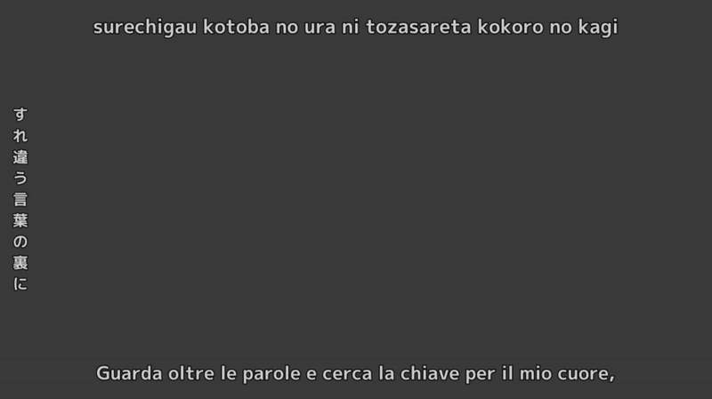

# Tutorial: Complete Karaoke with Romaji, Kanji & Translation

Great progress so far! You've built a solid karaoke effect for romaji lines, but if you look at your ASS file, you'll notice there are actually three types of subtitle lines that need attention. In this tutorial, we'll extend your organized effect to handle all subtitle types: romaji (phonetic), kanji (Japanese characters), and translation (Italian) lines.

This is where your organized code structure really pays off—we'll reuse your existing effect functions and add specialized handling for each subtitle type.

## Materials

We'll continue working with the same [romaji_kanji_translation.ass](https://github.com/CoffeeStraw/PyonFX/blob/v1.0.0/examples/ass/romaji_kanji_translation.ass) file, but this time we'll process all the lines instead of filtering out the kanji and translation lines.

## Code Walkthrough

**0. Setup with Vertical Kanji**

We start similarly, but with one important addition—the `vertical_kanji` parameter:

```python
from pyonfx import Ass, Line, Syllable, Utils

io = Ass("../../ass/romaji_kanji_translation.ass", vertical_kanji=True)
meta, styles, lines = io.get_data()
```

The `vertical_kanji=True` parameter tells PyonFX to automatically rotate lines with alignment 4-6 to vertical orientation, which is traditional for Japanese text display. PyonFX handles all the complex positioning math for you.

**1. Reusing Our Effect Functions**

The beauty of our organized approach becomes clear here—we can reuse the exact same effect functions from the previous tutorial:

```python
@io.track
def leadin_effect(line: Line, syl: Syllable, l: Line):
    l.layer = 0
    l.start_time = line.start_time - line.leadin // 2
    l.end_time = line.start_time + syl.start_time

    tags = rf"\an5\pos({syl.center},{syl.middle})\fad({line.leadin // 2},0)"
    l.text = f"{{{tags}}}{syl.text}"

    io.write_line(l)

@io.track
def main_effect(line: Line, syl: Syllable, l: Line):
    # ... same as before ...

@io.track
def leadout_effect(line: Line, syl: Syllable, l: Line):
    # ... same as before ...
```

These functions work perfectly for both romaji and kanji because they use the segment's positioning properties (`syl.center`, `syl.middle`), which PyonFX calculates correctly regardless of text orientation.

**2. Creating Subtitle Type Handlers**

Now we'll create specialized functions for each subtitle type. Let's start with the romaji handler:

```python
@io.track
def romaji(line: Line, l: Line):
    for syl in Utils.all_non_empty(line.syls):
        leadin_effect(line, syl, l)
        main_effect(line, syl, l)
        leadout_effect(line, syl, l)
```

This is identical to our main loop from the previous tutorial, just wrapped in a function.

**3. Kanji Handler**

For kanji lines, we'll create a separate handler:

```python
@io.track
def kanji(line: Line, l: Line):
    for syl in Utils.all_non_empty(line.syls):
        leadin_effect(line, syl, l)
        main_effect(line, syl, l)
        leadout_effect(line, syl, l)
```

You might notice this looks identical to the romaji function. While they're the same now, having separate handlers is good practice—in more complex effects, you might want different colors, positioning, or scaling for each subtitle type. This structure makes those future customizations easy.

Also, we're using syllable-level processing here because each syllable in our input file happens to be exactly one Japanese character. But what if your kanji line had multi-character syllables? In that case, you'd want to iterate over `line.chars` instead to get true character-by-character effects. Keep this in mind for future projects!

**4. Translation Handler - A Different Approach**

Translation lines need different treatment. They're not meant for karaoke timing—they're for comprehension. A simple fade in/out works better:

```python
@io.track
def translation(line: Line, l: Line):
    l.start_time = line.start_time - line.leadin // 2
    l.end_time = line.end_time + line.leadout // 2

    tags = rf"\fad({line.leadin // 2}, {line.leadout // 2})"
    l.text = f"{{{tags}}}{line.text}"

    io.write_line(l)
```

This creates a gentle fade-in at the beginning and fade-out at the end, using the full line duration. No syllable processing, no complex timing—just clean, readable subtitles that don't compete with the karaoke effects above them.

**5. The Dispatch Logic**

Now we tie it all together with logic that automatically chooses the right handler based on alignment:

```python
# Generating lines
for line in Utils.all_non_empty(lines):
    l = line.copy()
    if line.styleref.alignment >= 7:
        romaji(line, l)
    elif line.styleref.alignment >= 4:
        kanji(line, l)
    else:
        translation(line, l)
```

This dispatch system routes each line to its appropriate handler:

- **Alignment 7+**: Romaji lines get full karaoke treatment
- **Alignment 4-6**: Kanji lines get the same karaoke treatment (but vertical)
- **Alignment 1-3**: Translation lines get simple fade effects

**6. Understanding the Results**

Save and preview your complete karaoke system:

```python
io.save()
io.open_aegisub()
```

You'll now see a complete karaoke experience:

- **Romaji syllables** highlighting horizontally as they're sung
- **Kanji characters** highlighting vertically in sync with the romaji  
- **Translation lines** fading in and out cleanly at the bottom



## Conclusion

Excellent work! :tada: You've just completed the beginner series and created a complete, professional karaoke system that handles all three subtitle types appropriately. You've learned how organized code enables easy extension, how PyonFX's features like `vertical_kanji` make complex layouts manageable, and how to structure effects that can grow with your needs.

You now have the foundation to stand on your own and create simple karaoke effects for any project 🥲. You understand text segmentation, timing, positioning, and how to organize your code for maintainability and reuse.

In the next tutorial series, "Intermediate," we'll explore how to add variations to your karaoke effects and integrate ASS shapes using PyonFX's powerful shape module. Get ready to take your effects to the next level!

## Full Source Code
??? abstract "Show full source code"
    ```python
    --8<-- "examples/tutorials/1_beginner/03_romaji_kanji_translation.py"
    ```