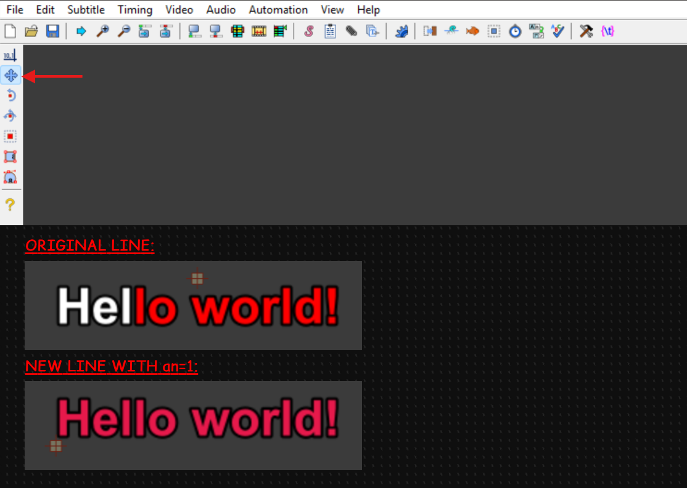
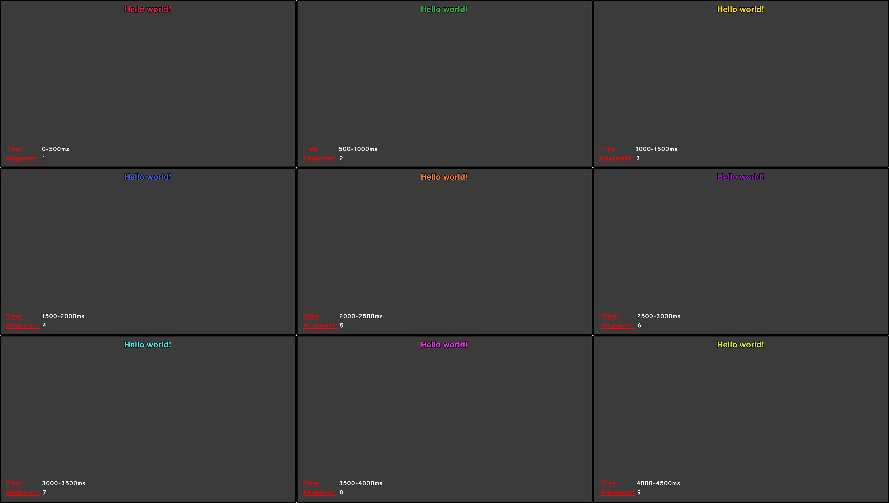

# Tutorial: Timing & Positioning with PyonFX

In this tutorial, you'll explore two fundamental aspects of subtitle manipulation: **positioning** and **timing**. You'll learn how to precisely place subtitles anywhere on screen using PyonFX's positioning properties, and how to control when they appear and disappear.

## Materials

As with previous tutorials, we'll continue working with the [hello_world.ass](https://github.com/CoffeeStraw/PyonFX/blob/v1.0.0/examples/ass/hello_world.ass) file.

## Understanding ASS Alignment Numbers

Before diving into the code, it's crucial to recall ASS alignment numbers. These numbers (1-9) determine how text is positioned relative to a given coordinate point:

```
7 ─ 8 ─ 9    (Top)
│   │   │
4 ─ 5 ─ 6    (Middle)
│   │   │
1 ─ 2 ─ 3    (Bottom)
```

- **1-3**: Bottom alignment (text sits above the coordinate)
- **4-6**: Middle alignment (text centers on the coordinate)
- **7-9**: Top alignment (text sits below the coordinate)
- **1,4,7**: Left alignment (text extends right from the coordinate)
- **2,5,8**: Center alignment (text centers on the coordinate)
- **3,6,9**: Right alignment (text extends left from the coordinate)

## Code Walkthrough

**0. Setup and Data Loading**

We begin with the familiar setup from previous tutorials:

```python
from pyonfx import Ass

# Load the input ASS file and get the data
io = Ass("../../ass/hello_world.ass")
meta, styles, lines = io.get_data()

# Create a copy of the first line for the output
line = lines[0]
l = line.copy()
```

From this tutorial onwards, we'll use the shorter variable name `l` for our line copies instead of longer names like `output_line`. Since we'll be creating many line copies in advanced effects, this shorter naming convention will keep our code more readable and concise.

**1. Understanding Timing Control**

Before exploring positioning, let's first understand how to control when our subtitle appears. We can modify the timing of our copied line:

```python
# Change the timing of our copied line
l.start_time = 0
l.end_time = 500
```

This sets the line to display from 0ms to 500ms (half a second).

**2. Positioning Properties**

PyonFX provides convenient properties for accessing different anchor points of a line:

- **Horizontal positions**: `line.left`, `line.center`, `line.right`
- **Vertical positions**: `line.top`, `line.middle`, `line.bottom`

These fields represent the pixel coordinates based on the text's layout and the video resolution.

> Note: while we're exploring these with full lines in this tutorial, these positioning properties become even more powerful when working with individual words, syllables, and characters within a line—allowing you to position each text element precisely where it originally appeared when creating advanced karaoke effects.

Now let's see how positioning works in practice. The original line in our ASS file uses a specific alignment number (`an8` for top-center). When rendered normally, you see the subtitle positioned according to that alignment at coordinates determined by the subtitle renderer.

But what if we want to take control and position our subtitle exactly where we want it? We can use PyonFX's positioning properties combined with the `\pos()` tag to place text at precise pixel coordinates.

For example, let's position our line using bottom-left alignment (`an1`) but place it exactly where the original text appeared:

```python
l.text = "{\\an1\\pos(%.3f,%.3f)}%s" % (line.left, line.bottom, line.text)
io.write_line(l)
```

Here's what's happening:

- `\\an1` sets the alignment to bottom-left
- `\\pos(%.3f,%.3f)` positions the text at specific pixel coordinates, which are passed as arguments:
    - `line.left` gives us the left edge coordinate of the original text
    - `line.bottom` gives us the bottom edge coordinate of the original text
- And finally, we use the `%s` placeholder to insert the original text.

Together, these place our `an1`-aligned text exactly where the original text appeared. Notice the difference of the control point position rendered in Aegisub:



**3. Demonstrating All Nine Alignments**

We can apply this same principle to all nine alignment numbers. Each alignment uses different combinations of PyonFX's positioning properties:

- **Bottom alignments**: `line.bottom` for vertical position
- **Middle alignments**: `line.middle` for vertical position  
- **Top alignments**: `line.top` for vertical position
- **Left alignments**: `line.left` for horizontal position
- **Center alignments**: `line.center` for horizontal position
- **Right alignments**: `line.right` for horizontal position

Let's create nine lines, each with different timing and a unique color to distinguish them visually:

```python
# an1 - Bottom Left
l.start_time = 0
l.end_time = 500
l.text = "{\\an1\\pos(%.3f,%.3f)\\1c&H4B19E6&}%s" % (line.left, line.bottom, line.text)
io.write_line(l)

# an2 - Bottom Center
l.start_time = 500
l.end_time = 1000
l.text = "{\\an2\\pos(%.3f,%.3f)\\1c&H4BB43C&}%s" % (line.center, line.bottom, line.text)
io.write_line(l)

# ... and so on for all nine alignments
```

Each line is positioned to appear in exactly the same visual location as the original, but uses a different alignment number and displays at a different time with a unique color.

**5. The Complete Nine-Alignment Demonstration**

If you continue with all the other alignments, you'll get a 4.5-second sequence where the same text appears in all nine alignment positions, with a different color for each alignment:

- **0.0-0.5s**: Bottom Left (an1)
- **0.5-1.0s**: Bottom Center (an2)  
- **1.0-1.5s**: Bottom Right (an3)
- **1.5-2.0s**: Middle Left (an4)
- **2.0-2.5s**: Perfect Center (an5)
- **2.5-3.0s**: Middle Right (an6)
- **3.0-3.5s**: Top Left (an7)
- **3.5-4.0s**: Top Center (an8)
- **4.0-4.5s**: Top Right (an9)

**6. Saving and Previewing**

As always, we finish by saving our output and opening it in Aegisub:

```python
io.save()
io.open_aegisub()
```

In the preview, you'll see your 9 new lines, each rendered as following:



## Conclusion

Excellent progress! :tada: You've mastered the fundamentals of subtitle positioning and timing with PyonFX. You now understand how ASS alignment numbers work, how to use PyonFX's positioning properties to place text precisely, and how to control your generated lines' timing.

In the next tutorial, we'll explore how to combine these positioning and timing concepts with text segments (words, syllables, and characters).

## Full Source Code
??? abstract "Show full source code"
    ```python
    --8<-- "examples/tutorials/0_first_steps/03_time_and_space.py"
    ```